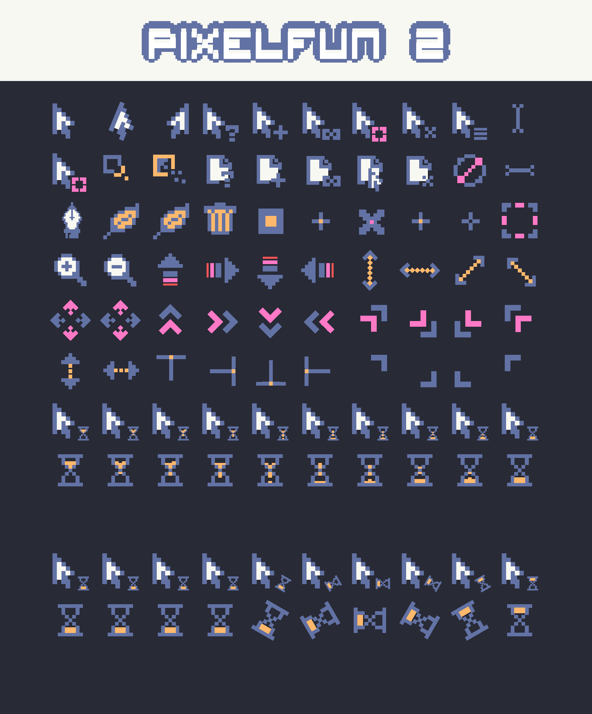

Wanna see previews of all the color variants? Check out the
[previews/](previews/README.md) directory!

This cursor theme was created by [zealkane](https://www.deviantart.com/zealkane) and the original files are
hosted on [DeviantArt](https://www.deviantart.com/zealkane/art/PixelFun-2-165038800). The files are licensed as
the [Creative Commons Attribution-Noncommercial 3.0](http://creativecommons.org/licenses/by-nc/3.0/).

These cursors were never designed for actual use but were instead the artist's
mockup. The original files supplied by the artist are 20x20 pixel raster
images. I've converted these .png files into .svg files via [a public codepen application](https://cdpn.io/shshaw/debug/XbxvNj) (I had attempted this on my own with Inkscape but was unsuccessful).

The svg sheet and cover image is licensed as [Attribution-NonCommercial-ShareAlike 4.0 International (CC BY-NC-SA 4.0)](https://creativecommons.org/licenses/by-nc-sa/4.0/). There's not much
else worthwhile in this repo but what exists is released under [MIT](https://mit-license.org/). See COPYING for more details.

The icons have been altered for reasons including (but not limited to):

* Resizing for proper scaling versus other icons in the set
* Construction of new icons with components of other icons
* Animation!
* Palette swaps for alternative themes!

## Installation instructions

* Extract the .tar.gz folder that you downloaded
* Move the pixelfun2 directory (and any of the color variants beginning with "pixelfun-") to your user's icons directory (typically `~/.local/share/icons/`).
* Change your cursor selection in your desktop environment and have fun being the coolest kid on the block!

## Building the cursors manually

First, install the prerequisites:

* Git
* ImageMagick or GraphicsMagick
* Inkscape (>=1.0)
* Python 3

This repository uses https://github.com/mxre/cursor as a submodule, so when you
clone the repository you'll want to do so recursively:

```
$ git clone --recursive git@git.sr.ht:~ainola/pixelfun2
```

If you forgot to recursively clone:

```
$ git submodule update --init
```

From here you can alter the .svg cursor sheet to your heart's desire. When
you're ready to build, just run `make`. After building, the cursor theme will
be ready for you in `build/`. You can quickly install it locally with:

## Submitting issues

The project is hosted on [sh.rt](https://git.sr.ht/~ainola/pixelfun2). Report
issues on the accompanying [todo tracker](https://todo.sr.ht/~ainola/pixelfun2).
